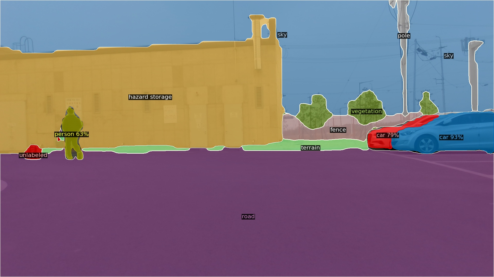

# ROS-PanopticFCN

This is a ROS package developed for **PanopticFCN in ROS topic images**. It's based on PanopticFCN with detectron2 and you can also use custom models if you want. The available weights are **pth files**.

**This branch customed by nepes factory dataset**


<div align="center">
    <a href="./">
        
    </a>
</div>


**Subscribe topic (type):**

Image (sensor_msgs/Image)

**Publish topic (type):**

panoptic_info (panopticFCN/pano_msg)

panoptic visualization Image (sensor_msgs/Image)


## Preferences
We tested in
**ROS noetic**.

**Download** weights file
https://drive.google.com/file/d/1Nkl6wgi1-8Vq58f2XiewzyFuSVPd1ygW/view?usp=drive_link


``` shell
# clone to the ros catkin workspace
git clone https://github.com/IoRTKETI/ROS-PanopticFCN.git

# catkin make
cd ~/{your ros workspace PATH} && catkin_make

```


If you want publishing only panoptic info (not publishing panoptic Image).
``` shell
# ./scripts/pano_main.py
# line 86
self.visualization_Flag = False
```

If your subscribed topic is different.
``` shell
# ./scripts/pano_main.py
# line 83
subscribing_image_topic = '{your subscribed topic}'
```


## test
``` shell
# .config/PanopticFCN-R50-400-3x-FAST_hm.yaml
# line 3
WEIGHTS:  "{ros_path}/panopticFCN/scripts/model/model_final_FAST.pth"
```
``` shell
# use roslaunch
roslaunch panopticFCN pano_test.launch

# or

# use rosrun
roscore

# When subscribed to ros image, publish after prediction using panopticFCN
rosrun panopticFCN pano_main.py

# Publish images repeatedly
rosrun panopticFCN image_pub.py
```


